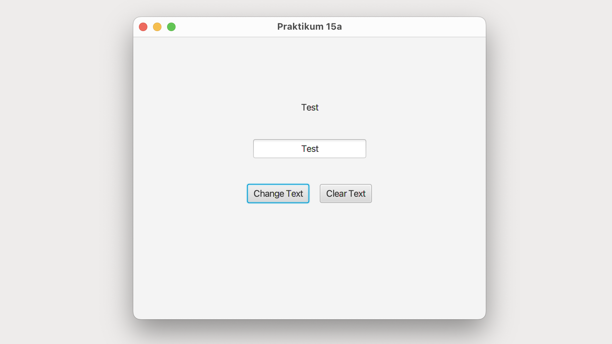

# Main (Main)

This program creates a simple JavaFX application featuring a graphical user interface with a label, a text field, and two buttons. The interface uses Scene Builder, a visual tool for building user interfaces. The AnchorPane layout is employed for precise element positioning and sizing. The program utilizes a controller class to handle button events, such as changing the label text and clearing the input field.

## GUI

