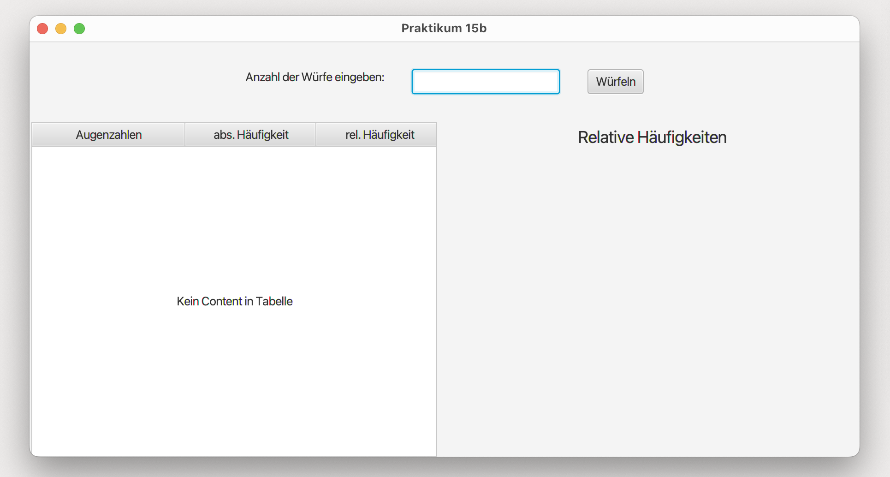
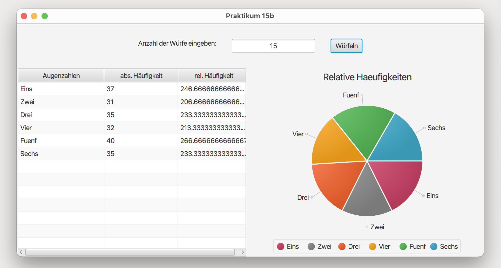

# Main (Main)

This JavaFX application simulates dice rolls and presents their statistical analysis through a graphical interface. Users can input the number of dice rolls in a text field and initiate the simulation by pressing a button. The application then calculates each rolled number's absolute and relative frequencies and displays them in a table. Additionally, the relative frequencies are represented in a pie chart. Users can modify the number of rolls during runtime, and the table and chart data will update automatically. An additional feature allows users to click on a pie chart sector to display the relative frequency of the selected sector next to the chart.

## GUI

