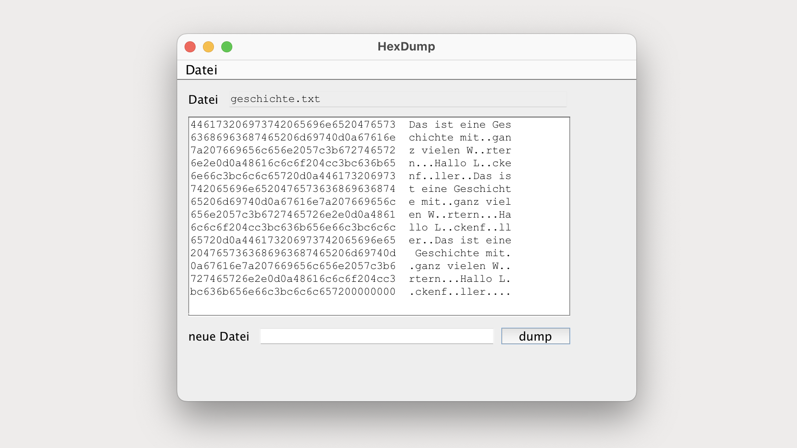

# HexDump (Main)

## GUI




# HexDumpTool (Main)

# Terminal Output

```bash
446173206973742065696e6520476573  Das ist eine Ges
63686963687465206d69740d0a67616e  chichte mit..gan
7a207669656c656e2057c3b672746572  z vielen W..rter
6e2e0d0a48616c6c6f204cc3bc636b65  n...Hallo L..cke
6e66c3bc6c6c65720d0a446173206973  nf..ller..Das is
742065696e6520476573636869636874  t eine Geschicht
65206d69740d0a67616e7a207669656c  e mit..ganz viel
656e2057c3b6727465726e2e0d0a4861  en W..rtern...Ha
6c6c6f204cc3bc636b656e66c3bc6c6c  llo L..ckenf..ll
65720d0a446173206973742065696e65  er..Das ist eine
2047657363686963687465206d69740d   Geschichte mit.
0a67616e7a207669656c656e2057c3b6  .ganz vielen W..
727465726e2e0d0a48616c6c6f204cc3  rtern...Hallo L.
bc636b656e66c3bc6c6c657200000000  .ckenf..ller....
```